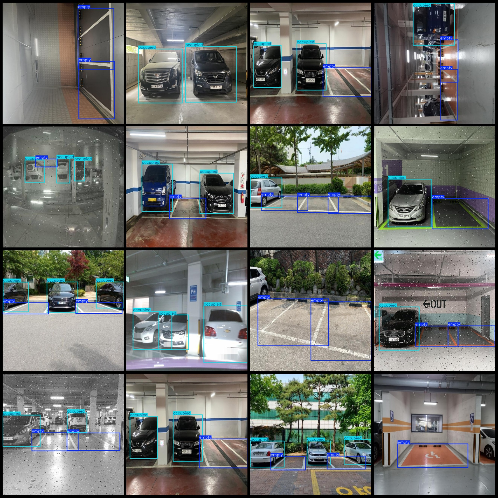
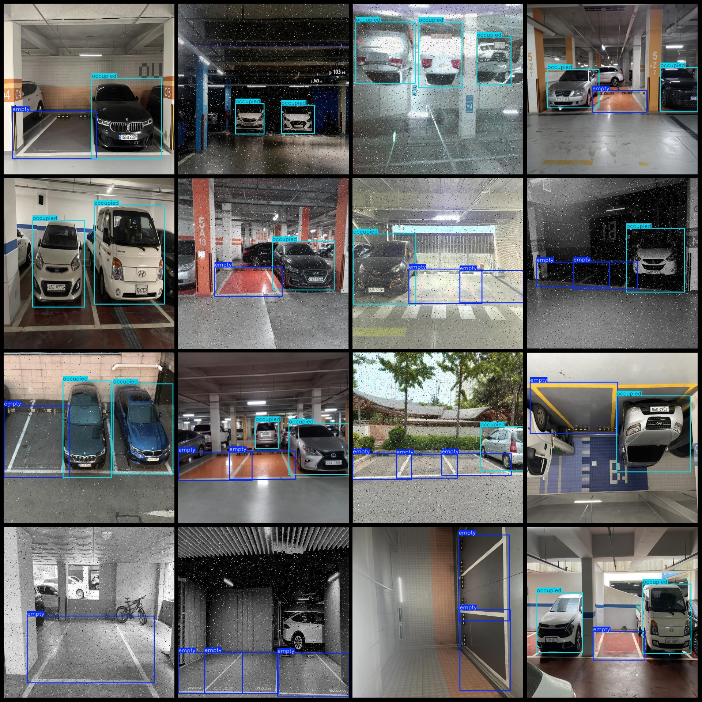

# Parking Space Occupancy Detection Dataset (VOC+YOLO) - 1009 Images in Pascal VOC and YOLO Format

Please note that the dataset contains augmented images, with a primary focus on augmentation, such as rotations of 90 or 180 degrees.

The dataset is formatted as follows: It consists of JPEG images along with corresponding VOC-format XML files and YOLO-format TXT files, without the split path.
There are 1009 images in total.
There are 1009 XML files for labels.
There are 1009 TXT files for labels.
The number of categories in the dataset is 2.
The category names in the XML files correspond to the "empty" and "occupied" categories mentioned in the labels folder's "classes.txt" file.
The number of boxes per category is as follows:
Empty boxes = 1315
Occupied boxes = 1714
Total boxes = 3029
The number of images per category is as follows:
Empty images = 851
Occupied images = 842
Image resolution: 640x640
Annotation tool used: labelImg
Annotation rules: Draw rectangular boxes around the categories
Important Notice: The dataset does not have been split into training, validation, and test sets. You need to divide it yourself.
Special Disclaimer: This dataset does not guarantee the accuracy of models trained on it or any weights files.

**Annotation Example:**

## Images

Here is a pay link on Stripe ( https://buy.stripe.com/3cs8yP7sY87d0vu9AB ). Please contact me lonlonago@foxmail.com after funding $89, and I will send you a complete data files , thank you!

